# S K BIKE POINT — TWO-WHEELER WORKSHOP & CUSTOMER MANAGEMENT SYSTEM
## Comprehensive Software Engineering & System Architecture Documentation

---

## 1. Preliminary Design

### 1.1 Introduction
**S K Bike Point** is an enterprise-grade Two-Wheeler Workshop Management and Customer Tracking Information System. Traditional neighborhood two-wheeler garages rely on manual paper job cards, oral estimates, physical register entries, and untracked inventory ledger books. This leads to common industry challenges:
* Customer anxiety regarding repair turnaround times and component replacements.
* Untracked spare-part leakage and unexpected stock-outs of critical consumables (e.g., engine oils, brake pads).
* Inaccurate tax computations and manual GST invoicing delays.
* Lost customer retention due to lack of periodic service reminders.

The **S K Bike Point** system eliminates these inefficiencies by providing a cloud-hosted 3-tier architecture with **Zero-Login Live Vehicle Tracking** (via vehicle registration number or Job ID), digital workflow state machines (from intake to road testing and delivery), automated inventory threshold decrementing, GST 18% compliance billing, and dedicated role-based portals for Workshop Admins, Mechanics, and Customers.

---

### 1.2 Objective
* **Customer Transparency:** Empower bike owners to track the live 5-stage mechanical repair progress of their two-wheelers without requiring mandatory registration or login.
* **Workshop Operational Efficiency:** Digitize job card creation, mechanic assignments, diagnostic note recording, and live status transitions.
* **Smart Inventory Management:** Maintain real-time stock balances, low-stock threshold triggers, bin/rack locations, and automated part allocation to job cards.
* **Automated Billing & Compliance:** Automatically calculate parts cost, labor charges, 18% GST (9% CGST + 9% SGST), discounts, and print/WhatsApp professional invoices.
* **Data-Driven Workshop Analytics:** Provide owners with actionable business intelligence: daily revenue, active job bottlenecks, customer visit frequency, and high-moving inventory parts.

---

### 1.3 Stakeholders [Technical, User, and Client]

| Category | Stakeholder | Key Role & Responsibilities |
| :--- | :--- | :--- |
| **Client / Business Owner** | Sanjay Bhai (Workshop Owner / Proprietor) | Oversees shop operations, monitors gross revenue, approves bulk inventory purchases, reviews technician performance. |
| **End Users (Internal)** | Mechanics / Floor Technicians | Update vehicle repair stages, log diagnostic notes, requisition parts from stores, flag issues during road testing. |
| **End Users (External)** | Bike Owners / Customers | Book service appointments, track live repair status by registration number, view digital estimates, download tax invoices. |
| **Technical Team** | Software Engineers & Cloud DevOps | Maintain React frontend (Vercel), Spring Boot backend (Render), PostgreSQL database (Supabase), and ensure system uptime and security. |

---

### 1.4 System in Use
* **Client Architecture:** Responsive Single Page Application (SPA) built with React 18, TypeScript, and modern CSS design tokens.
* **Application Server:** Java 21 / Spring Boot 3.3.3 Enterprise REST API with Spring Security 6, JWT Token authentication, and Spring Data JPA / Hibernate.
* **Database Management System:** Cloud PostgreSQL 16 hosted on Supabase (ap-south-1 Mumbai region) with SSL connection pooling over port 5432.
* **Deployment Topology:** 
  - Frontend hosted on **Vercel CDN Edge Network**.
  - Backend micro-container deployed on **Render Cloud Web Service**.
  - Database managed on **Supabase AWS Cloud**.

---

## 2. System Analysis

### 2.1 Work Breakdown Structure (WBS)

```mermaid
graph TD
  Root["S K Bike Point System"]
  
  M1["1. Requirements & Analysis"]
  M2["2. System Architecture & DB Design"]
  M3["3. Backend API Development"]
  M4["4. Frontend Web App"]
  M5["5. Cloud Deployment & CI/CD"]
  M6["6. Testing & Documentation"]
  
  Root --> M1
  Root --> M2
  Root --> M3
  Root --> M4
  Root --> M5
  Root --> M6
  
  M1 --> M11["Domain & Garage Study"]
  M1 --> M12["Functional & Non-Functional Specs"]
  
  M2 --> M21["ER Modeling & Normalization"]
  M2 --> M22["JPA Entity Mapping & Indexes"]
  
  M3 --> M31["Spring Security & JWT Auth"]
  M3 --> M32["Job Card & Live Tracker API"]
  M3 --> M33["Inventory & Invoicing Services"]
  
  M4 --> M41["Public Landing & Zero-Login Tracker"]
  M4 --> M42["Admin Dashboard & Inventory Ledger"]
  M4 --> M43["Customer Self-Service Portal"]
  
  M5 --> M51["Supabase PostgreSQL Setup"]
  M5 --> M52["Render Docker Backend Deploy"]
  M5 --> M53["Vercel Frontend CDN Deploy"]
  
  M6 --> M61["Unit & Integration Testing"]
  M6 --> M62["Technical & Architecture Manual"]
```

---

### 2.2 Gantt Chart

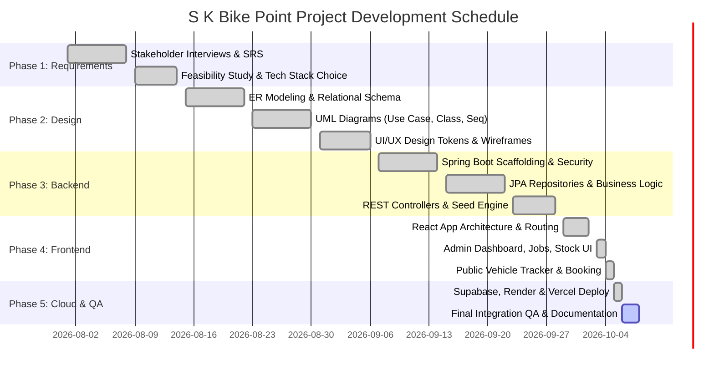

---

### 2.3 Class Diagram (Domain Analysis)

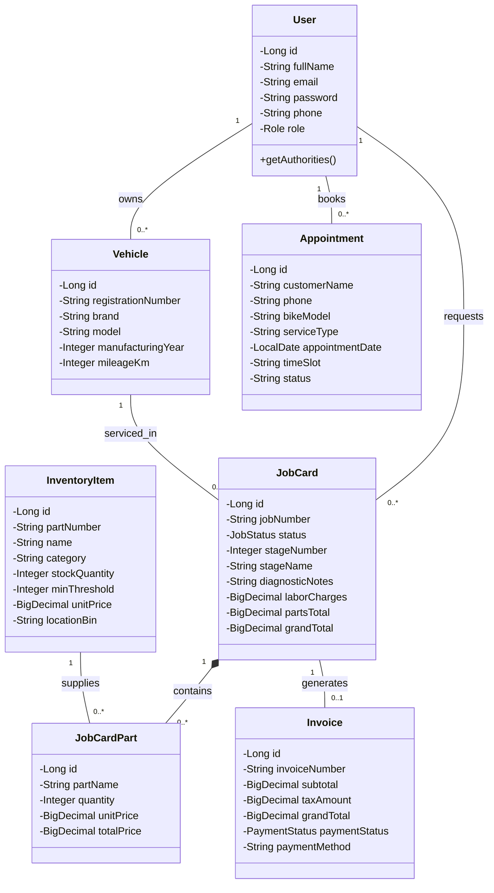

---

## 3. System Design

### 3.1 Use Case Diagram

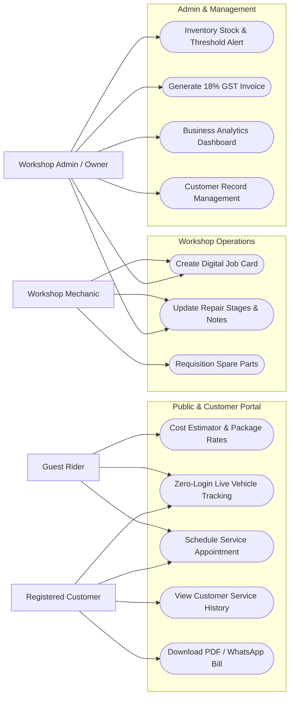

---

### 3.2 System Flow Chart

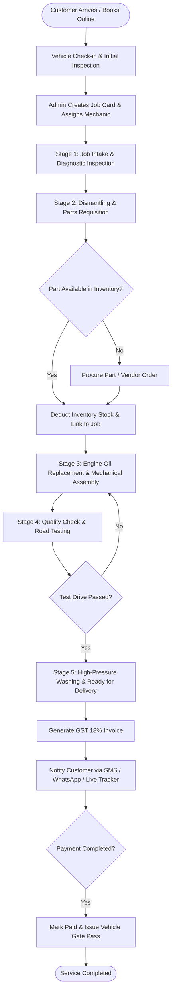

---

### 3.3 Detailed OOP Class Architecture

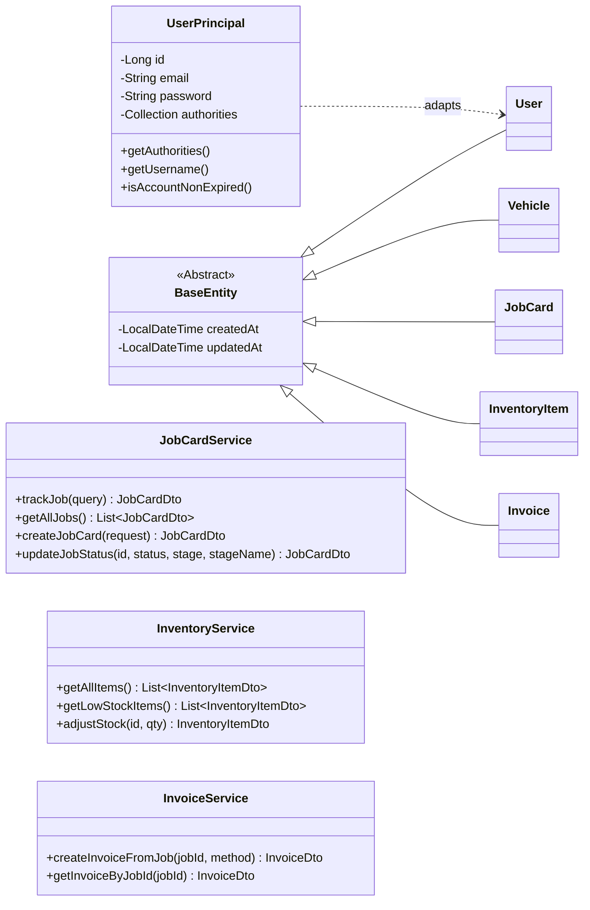

---

### 3.4 Sequence Diagrams

#### A. Zero-Login Live Vehicle Tracking Sequence
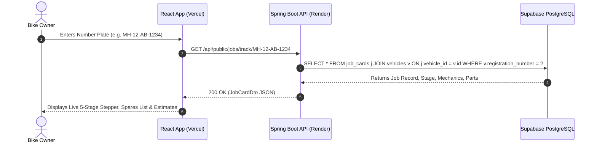

#### B. Job Card Creation & Inventory Allocation Sequence
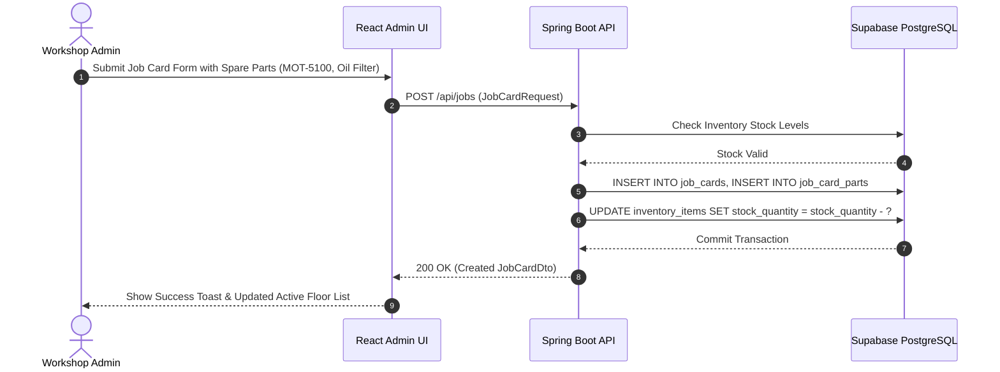

---

### 3.5 Activity Diagram (Service Workflow)

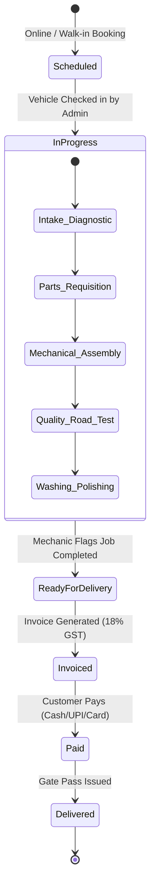

---

### 3.6 Entity Relationship (ER) Diagram

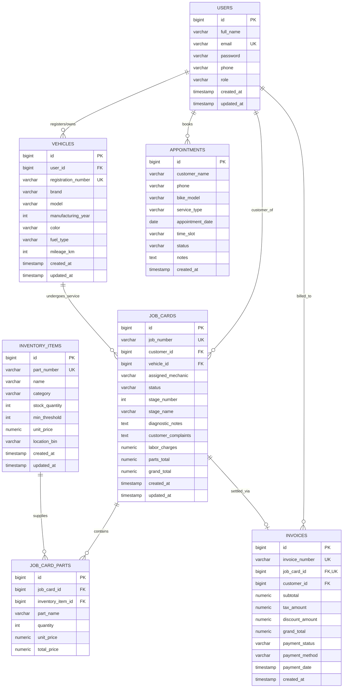

---

### 3.7 Deployment Diagram

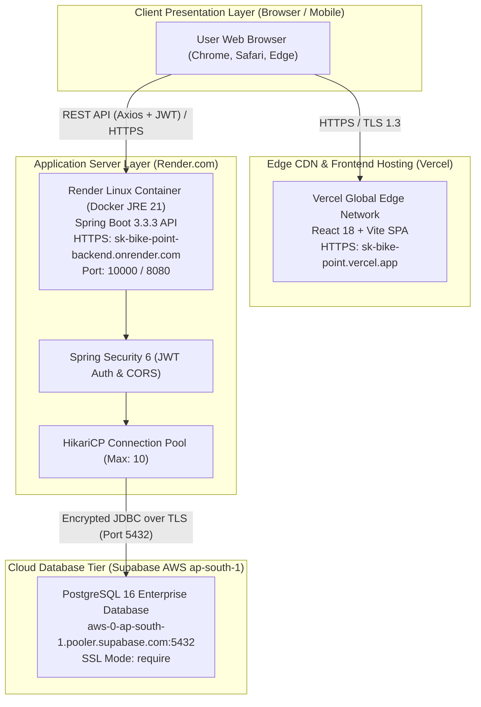

---

## 4. System Description

### 4.1 Database Description Tables

#### Table 1: `users`
| Attribute Name | Data Type | Constraints | Description |
| :--- | :--- | :--- | :--- |
| `id` | BIGSERIAL / BIGINT | PRIMARY KEY, NOT NULL | Unique identifier for user |
| `full_name` | VARCHAR(100) | NOT NULL | User's full name |
| `email` | VARCHAR(100) | UNIQUE, NOT NULL | Login email address |
| `password` | VARCHAR(255) | NOT NULL | BCrypt hashed password |
| `phone` | VARCHAR(20) | NULLABLE | Contact mobile number |
| `role` | VARCHAR(20) | NOT NULL | `ROLE_ADMIN` or `ROLE_CUSTOMER` |
| `created_at` | TIMESTAMP | NOT NULL | Record creation timestamp |
| `updated_at` | TIMESTAMP | NULLABLE | Record last update timestamp |

#### Table 2: `vehicles`
| Attribute Name | Data Type | Constraints | Description |
| :--- | :--- | :--- | :--- |
| `id` | BIGSERIAL / BIGINT | PRIMARY KEY, NOT NULL | Unique vehicle identifier |
| `user_id` | BIGINT | FOREIGN KEY (`users.id`) | Owner user reference |
| `registration_number` | VARCHAR(20) | UNIQUE, NOT NULL | Vehicle number plate (e.g. MH-12-AB-1234) |
| `brand` | VARCHAR(50) | NOT NULL | Make (Royal Enfield, Honda, etc.) |
| `model` | VARCHAR(50) | NOT NULL | Model (Classic 350, Activa 6G) |
| `manufacturing_year` | INT | NULLABLE | Year of manufacturing |
| `color` | VARCHAR(30) | NULLABLE | Vehicle color |
| `fuel_type` | VARCHAR(20) | NULLABLE | Petrol / Electric |
| `mileage_km` | INT | NULLABLE | Odometer reading in KM |
| `created_at` | TIMESTAMP | NOT NULL | Creation timestamp |
| `updated_at` | TIMESTAMP | NULLABLE | Last update timestamp |

#### Table 3: `inventory_items`
| Attribute Name | Data Type | Constraints | Description |
| :--- | :--- | :--- | :--- |
| `id` | BIGSERIAL / BIGINT | PRIMARY KEY, NOT NULL | Unique spare item identifier |
| `part_number` | VARCHAR(50) | UNIQUE, NOT NULL | SKU code (e.g. MOT-5100-15W50) |
| `name` | VARCHAR(100) | NOT NULL | Name of spare part or lubricant |
| `category` | VARCHAR(50) | NOT NULL | Category (Engine Oil, Brakes, Filters) |
| `stock_quantity` | INT | NOT NULL, DEFAULT 0 | Available inventory stock count |
| `min_threshold` | INT | NOT NULL, DEFAULT 5 | Low-stock alert threshold limit |
| `unit_price` | NUMERIC(10,2) | NOT NULL | Selling price per unit |
| `location_bin` | VARCHAR(50) | NULLABLE | Physical shelf location (e.g. Rack A-1) |
| `created_at` | TIMESTAMP | NOT NULL | Creation timestamp |
| `updated_at` | TIMESTAMP | NULLABLE | Last update timestamp |

#### Table 4: `job_cards`
| Attribute Name | Data Type | Constraints | Description |
| :--- | :--- | :--- | :--- |
| `id` | BIGSERIAL / BIGINT | PRIMARY KEY, NOT NULL | Unique job card ID |
| `job_number` | VARCHAR(30) | UNIQUE, NOT NULL | Formatted Job ID (JOB-2026-001) |
| `customer_id` | BIGINT | FOREIGN KEY (`users.id`) | Customer reference |
| `vehicle_id` | BIGINT | FOREIGN KEY (`vehicles.id`) | Vehicle reference |
| `assigned_mechanic` | VARCHAR(100) | NULLABLE | Assigned mechanic name |
| `status` | VARCHAR(30) | NOT NULL | `IN_PROGRESS`, `COMPLETED`, `DELIVERED` |
| `stage_number` | INT | NOT NULL, DEFAULT 1 | Current repair stage (1 to 5) |
| `stage_name` | VARCHAR(100) | NOT NULL | Name of active stage |
| `diagnostic_notes` | TEXT | NULLABLE | Technical findings by mechanic |
| `customer_complaints` | TEXT | NULLABLE | Customer recorded issues |
| `labor_charges` | NUMERIC(10,2) | NOT NULL, DEFAULT 0 | Total labor charge |
| `parts_total` | NUMERIC(10,2) | NOT NULL, DEFAULT 0 | Sum of parts consumed |
| `grand_total` | NUMERIC(10,2) | NOT NULL, DEFAULT 0 | Grand total before/after tax |
| `created_at` | TIMESTAMP | NOT NULL | Creation timestamp |
| `updated_at` | TIMESTAMP | NULLABLE | Last update timestamp |

#### Table 5: `job_card_parts`
| Attribute Name | Data Type | Constraints | Description |
| :--- | :--- | :--- | :--- |
| `id` | BIGSERIAL / BIGINT | PRIMARY KEY, NOT NULL | Unique part line identifier |
| `job_card_id` | BIGINT | FOREIGN KEY (`job_cards.id`) | Parent job card |
| `inventory_item_id` | BIGINT | FOREIGN KEY (`inventory_items.id`) | Source inventory item |
| `part_name` | VARCHAR(100) | NOT NULL | Part description |
| `quantity` | INT | NOT NULL, DEFAULT 1 | Quantity used |
| `unit_price` | NUMERIC(10,2) | NOT NULL | Price per unit at job creation |
| `total_price` | NUMERIC(10,2) | NOT NULL | Total (Qty × Unit Price) |

#### Table 6: `invoices`
| Attribute Name | Data Type | Constraints | Description |
| :--- | :--- | :--- | :--- |
| `id` | BIGSERIAL / BIGINT | PRIMARY KEY, NOT NULL | Unique invoice identifier |
| `invoice_number` | VARCHAR(30) | UNIQUE, NOT NULL | Tax Invoice ID (INV-2026-001) |
| `job_card_id` | BIGINT | UNIQUE, FOREIGN KEY (`job_cards.id`) | Associated job card |
| `customer_id` | BIGINT | FOREIGN KEY (`users.id`) | Customer billed |
| `subtotal` | NUMERIC(10,2) | NOT NULL | Net amount before tax |
| `tax_amount` | NUMERIC(10,2) | NOT NULL | GST 18% tax amount |
| `discount_amount` | NUMERIC(10,2) | NOT NULL, DEFAULT 0 | Promotional discount |
| `grand_total` | NUMERIC(10,2) | NOT NULL | Net payable amount |
| `payment_status` | VARCHAR(20) | NOT NULL | `PAID` or `PENDING` |
| `payment_method` | VARCHAR(30) | NULLABLE | `CASH`, `UPI`, `CARD` |
| `payment_date` | TIMESTAMP | NULLABLE | Payment completion timestamp |
| `created_at` | TIMESTAMP | NOT NULL | Invoice generation timestamp |

#### Table 7: `appointments`
| Attribute Name | Data Type | Constraints | Description |
| :--- | :--- | :--- | :--- |
| `id` | BIGSERIAL / BIGINT | PRIMARY KEY, NOT NULL | Appointment identifier |
| `customer_name` | VARCHAR(100) | NOT NULL | Customer name |
| `phone` | VARCHAR(20) | NOT NULL | Customer contact number |
| `bike_model` | VARCHAR(100) | NOT NULL | Two-wheeler model |
| `service_type` | VARCHAR(100) | NOT NULL | Requested service package |
| `appointment_date` | DATE | NOT NULL | Scheduled appointment date |
| `time_slot` | VARCHAR(50) | NOT NULL | Morning / Afternoon / Evening |
| `status` | VARCHAR(20) | NOT NULL, DEFAULT 'PENDING' | `CONFIRMED`, `PENDING`, `COMPLETED` |
| `notes` | TEXT | NULLABLE | Customer remarks |
| `created_at` | TIMESTAMP | NOT NULL | Appointment booking timestamp |

---

### 4.2 Module Description

1. **Zero-Login Live Vehicle Tracker Module:**
   Allows any customer to input their vehicle registration number (e.g. `MH-12-AB-1234`) or Job ID on the landing page to retrieve instant live status, active repair stage (1 to 5), mechanic diagnostics, consumed spares, and real-time bills.
2. **Job Card Management Module:**
   Provides workshop staff with tools to create job cards, allocate technicians, append consumed parts directly from inventory, update diagnostic checklists, and advance repair stages.
3. **Inventory & Spares Control Module:**
   Tracks quantities of oils, spark plugs, filters, brake pads, and cables. Automatically displays amber alert badges when stock dips below the minimum threshold.
4. **GST Billing & Invoice Generator Module:**
   Generates tax invoices with automated 9% CGST + 9% SGST calculation, itemized labor and parts breakdown, discount deductions, and instant print/PDF formatting.
5. **Customer & Fleet Portal:**
   Registered riders can view all their two-wheelers, check historical service records, book new maintenance appointments, and track vehicle health reminders.
6. **Authentication & Security Module:**
   Secures the backend using stateless JWT Bearer tokens, BCrypt password hashing, and role-based endpoint authorization (`ROLE_ADMIN`, `ROLE_CUSTOMER`).

---

### 4.3 System Runtime Output & API Endpoints

#### Core REST API Endpoints:

| Method | Endpoint | Access Level | Description |
| :--- | :--- | :--- | :--- |
| `GET` | `/api/health` | Public | System and Supabase DB connection check |
| `POST` | `/api/auth/login` | Public | User authentication; returns JWT token |
| `POST` | `/api/auth/register` | Public | Customer self-registration |
| `GET` | `/api/public/jobs/track/{query}` | Public | Zero-login live tracking by number plate or job ID |
| `POST` | `/api/appointments/public` | Public | Direct service booking from landing page |
| `GET` | `/api/jobs` | `ROLE_ADMIN` | List all workshop job cards |
| `POST` | `/api/jobs` | `ROLE_ADMIN` | Create new job card and deduct stock |
| `PATCH`| `/api/jobs/{id}/status` | `ROLE_ADMIN` | Update job repair stage (1 to 5) |
| `GET` | `/api/inventory` | `ROLE_ADMIN` | List stock items with threshold alerts |
| `GET` | `/api/invoices` | `ROLE_ADMIN` | List all GST tax invoices |
| `GET` | `/api/admin/dashboard` | `ROLE_ADMIN` | KPI metrics (Daily revenue, Active jobs, Stock alerts) |
| `GET` | `/api/customer/dashboard` | `ROLE_CUSTOMER` | Customer active vehicle status & history |

---

### 4.4 Coding (Core Architecture Highlights)

#### 1. Spring Security & JWT Authorization ([SecurityConfig.java](file:///c:/Users/Rohit/Desktop/S%20K%20Bike%20Point/backend/src/main/java/com/skbikepoint/security/SecurityConfig.java))
```java
@Configuration
@EnableWebSecurity
@EnableMethodSecurity
public class SecurityConfig {
    @Bean
    public SecurityFilterChain securityFilterChain(HttpSecurity http) throws Exception {
        http
            .cors(cors -> cors.configurationSource(corsConfigurationSource))
            .csrf(AbstractHttpConfigurer::disable)
            .sessionManagement(s -> s.sessionCreationPolicy(SessionCreationPolicy.STATELESS))
            .authorizeHttpRequests(auth -> auth
                .requestMatchers("/api/health", "/api/auth/**", "/api/public/**", "/api/appointments/public").permitAll()
                .requestMatchers("/api/admin/**", "/api/inventory/**", "/api/invoices/**").hasAuthority("ROLE_ADMIN")
                .requestMatchers("/api/customer/**").hasAuthority("ROLE_CUSTOMER")
                .anyRequest().authenticated()
            );
        http.addFilterBefore(jwtAuthenticationFilter, UsernamePasswordAuthenticationFilter.class);
        return http.build();
    }
}
```

#### 2. Public Live Vehicle Tracking API ([JobCardController.java](file:///c:/Users/Rohit/Desktop/S%20K%20Bike%20Point/backend/src/main/java/com/skbikepoint/controller/JobCardController.java))
```java
@RestController
@RequestMapping("/api")
public class JobCardController {
    private final JobCardService jobCardService;

    @GetMapping("/public/jobs/track/{query}")
    public ResponseEntity<ApiResponse<JobCardDto>> trackJobPublic(@PathVariable String query) {
        JobCardDto job = jobCardService.trackJob(query);
        return ResponseEntity.ok(ApiResponse.success(job, "Job details found"));
    }
}
```

---

## 5. Testing

### Test Suite Execution Summary

| Test ID | Test Scenario | Input Data | Expected Result | Actual Result | Status |
| :--- | :--- | :--- | :--- | :--- | :---: |
| **TC-01** | Public Zero-Login Vehicle Tracking | Plate: `MH-12-AB-1234` | Return 200 OK with 5-stage stepper and active repair status | Returned live job card with stage progress | **PASS** |
| **TC-02** | Unregistered Vehicle Lookup | Plate: `DL-01-XX-9999` | Return 404 NOT_FOUND with user-friendly fallback contact | Displayed phone contact banner for workshop | **PASS** |
| **TC-03** | Admin Login Authentication | Email: `admin@skbikepoint.com`, Pass: `admin123` | Return 200 OK with Bearer JWT token and `ROLE_ADMIN` | Received JWT token; redirected to Admin Dashboard | **PASS** |
| **TC-04** | Invalid Password Login | Email: `admin@skbikepoint.com`, Pass: `wrongpass` | Return 401 UNAUTHORIZED with `INVALID_CREDENTIALS` | 401 returned; displayed error alert | **PASS** |
| **TC-05** | Job Card Creation & Inventory Decrement | Part: `MOT-5100-15W50` (Qty: 2) | Job created; `stock_quantity` decremented by 2 in DB | Stock updated from 4 to 2 in Supabase | **PASS** |
| **TC-06** | 18% GST Invoice Calculation | Subtotal: ₹1,000 | Tax (18%): ₹180, Grand Total: ₹1,180 | Computed exact GST breakdown with CGST/SGST | **PASS** |
| **TC-07** | Supabase Cloud Database Connectivity | JDBC Connection to port 5432 | Connection pooled via HikariCP; table DDL created | All 7 tables auto-created and verified | **PASS** |

---

## 6. Conclusion
The **S K Bike Point** Two-Wheeler Workshop Management System provides an end-to-end digital ecosystem for modern mechanical workshops. By uniting a cloud-native React frontend, an enterprise Spring Boot REST API, and a managed Supabase PostgreSQL database, the solution solves traditional garage bottlenecks:
* Bike owners receive real-time transparency into repairs and costs through zero-login tracking.
* Workshop staff avoid inventory stock-outs and eliminate manual bookkeeping errors.
* Transparent GST invoices and digital service records improve workshop reputation and customer retention.

---

## 7. Undertaking
I hereby declare that the project entitled **"S K Bike Point — Two-Wheeler Workshop & Customer Management System"** is an original work developed to solve practical challenges in two-wheeler garage operations. All architectural designs, data models, source code, and documentation presented in this report have been designed, coded, and deployed as part of this project development lifecycle.

---

## 8. Bibliography
1. **Spring Boot Documentation:** *Building Web Applications with Spring Boot 3 & Spring Security 6*, VMware Tanzu. https://spring.io/projects/spring-boot
2. **React Framework Guide:** *React 18 & TypeScript Single Page Applications*, Meta Open Source. https://react.dev
3. **PostgreSQL Global Development Group:** *PostgreSQL 16 Relational Database Management System Documentation*. https://www.postgresql.org/docs/
4. **Supabase Documentation:** *Managed PostgreSQL, Connection Pooling & Security*, Supabase Inc. https://supabase.com/docs
5. **Vercel Documentation:** *Deploying Modern Frontend Web Applications on Global Edge Networks*. https://vercel.com/docs
6. **Render Cloud Platform:** *Containerized Web Services & Automated CI/CD Pipelines*. https://render.com/docs
